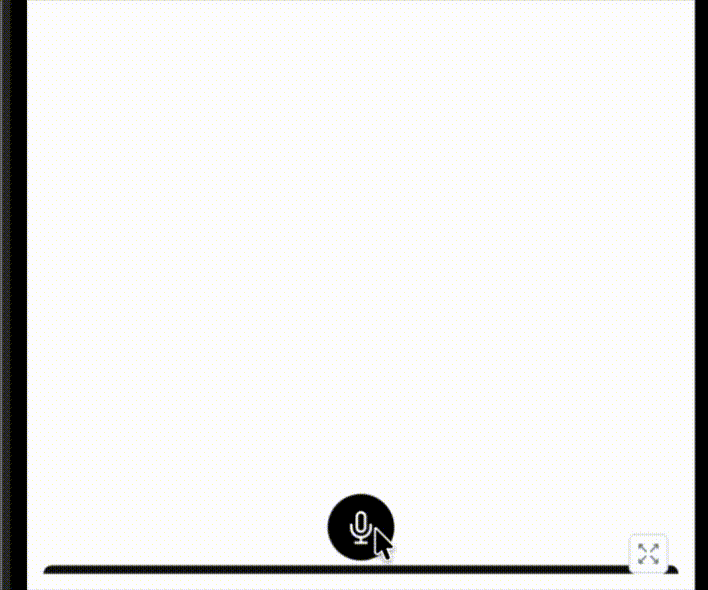

# Azhar UI

A collection of reusable UI components for React Native.

## Installation

```bash
npm install
# or
yarn install
```

## Running the Project

### Regular App

```bash
# Start Expo
npm start

# Run on iOS
npm run ios

# Run on Android
npm run android

# Run on Web
npm run web
```

### Storybook

View and develop components in isolation with Storybook.

**Mobile (React Native):**

```bash
# Start Storybook
npm run storybook

# iOS
npm run storybook:ios

# Android
npm run storybook:android
```

## Components

### Sliding Button


An interactive sliding button with gesture controls and visual feedback.

**Features:**

- Slide-to-confirm interaction
- Animated color transition while dragging
- Auto-reset after completion
- Customizable text and callback

**Usage:**

```tsx
import { SlidingButton } from "./components/SlidingButton";

<SlidingButton
  text="Slide to Confirm"
  onPress={() => console.log("Confirmed!")}
/>;
```

### VoiceRecorderSheet



A bottom sheet component for voice recording with transcription display.

**Features:**

- Tap mic button to open/close sheet
- Animated waveform indicator during recording
- Scrollable transcription text display
- Spring animations for smooth transitions
- Customizable callbacks for start/stop actions

**Usage:**

```tsx
import { VoiceRecorderSheet } from "./components/VoiceRecorderSheet";

<VoiceRecorderSheet
  onPress={() => console.log("Button pressed")}
  callVoiceListener={() => console.log("Recording started")}
  stopVoiceListener={() => console.log("Recording stopped")}
/>;
```

### Info Carousel


swipeable carousel with headlines, subtext, and optional buttons. Perfect for onboarding screens, feature highlights, or tips.

**Features**

- Swipe left/right to navigate between items

- Clickable buttons for actions

- Auto-next to the next item

**Usage:**

```tsx
import InfoCarousel from "./InfoCarousel";

<InfoCarousel
  items={[
    {
      id: 1,
      subtext: "Hello there!",
      heading: "Get timely reminders so nothing slips ",
    },
    {
      id: 2,
      subtext: "Easy to use",
      heading: "Scheduled Instantly added to your calendar",
    },
    {
      id: 3,
      subtext: "Let's begin.",
      heading: "Speak Your Plans Just say what you need to do",
    },
  ]}
/>;
```

## Tech Stack

- **React Native** - Mobile framework
- **Expo** - Development platform
- **Expo Router** - Navigation
- **Storybook** - Component development
- **TypeScript** - Type safety

## Key Dependencies

- `expo-linear-gradient` - Gradient components
- `@gorhom/bottom-sheet` - Bottom sheet UI
- `react-native-reanimated` - Animations
- `react-native-gesture-handler` - Gesture handling

## License

MIT
